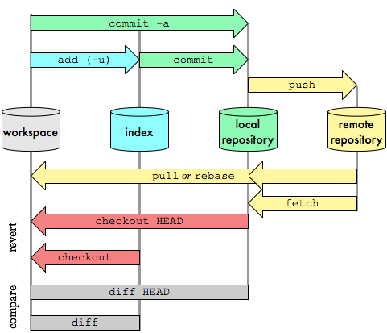
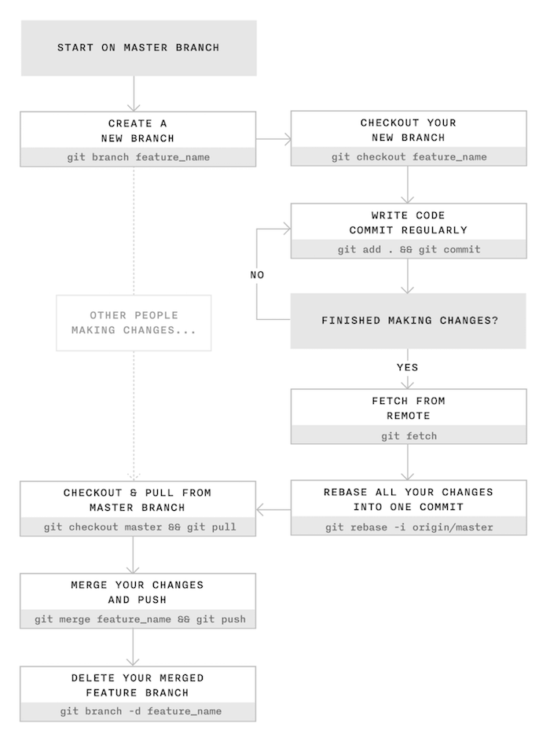

# Taller de introducción a `git` y GitHub

En este taller de introducción a `git` y [GitHub][1] aprenderemos los comandos básicos para empezar a trabajar con repositorios de forma local y remota.

1. [`git`](#git)  
  1.1 [Instalación y configuración de `git`](#instalación-y-configuración-de-git)  
  1.2 [Secciones principales de un repositorio `git`](#secciones-principales-de-un-repositorio-git)  
  1.3 [Estados de un archivo en `git`](#estados-de-un-archivo-en-git)  
  1.4 [Cómo trabajar con un repositorio local](#cómo-trabajar-con-un-repositorio-local)  
  1.5 [Cómo deshacer cambios](#cómo-deshacer-cambios)  
  1.6 [Borrando y moviendo/renombrando archivos](#borrando-y-moviendorenombrando-archivos)  
  1.7 [Cómo trabajar con un repositorio remoto](#cómo-trabajar-con-un-repositorio-remoto)  
  1.8 [Branches](#branches)  
  1.9 [Cómo trabajar en equipo con `git`](#cómo-trabajar-en-equipo-con-git)  
  1.10 [El archivo `.gitignore`](#el-archivo-gitignore)  
  1.11 [Consultar el historial de *commits*](#consultar-el-historial-de-commits)  
2. [GitHub](#github)  
  2.1 [Creación de un nuevo usuario](#crear-un-nuevo-usuario)  
  2.2 [Configuración de GitHub](#configuración-de-github)  
  2.3 [*Pull Requests* en GitHub](#pull-requests-en-github)  
  2.4 [*Issues* en GitHub](#issues-en-github)  

# `git`

## Instalación y configuración de `git`

### Instalación de `git`

#### Ubuntu

```
sudo apt-get update
sudo apt-get install git
```

#### Windows

Descargar desde la web oficial: http://git-scm.com/downloads.

### Configuración de `git`

Configuramos el nombre y el email que aparecerán en los *commits* que hagamos sobre los repositorios.

```
git config --global user.name "Nombre"
```

```
git config --global user.email "correo@electronico.com"
```

Para comprobar si se han aplicado los cambios podemos ejecutar el siguiente comando para mostrar cuál es la configuración actual de `git`:

```
git config --list
```

## Secciones principales de un repositorio `git`

En un repositorio `git` podemos diferenciar las siguientes secciones:

* *Workspace*
* *Staging area (Index)*
* *Local repository*
* *Remote repository*



Figura 1: Imagen de [Oliver Steele](http://osteele.com).

## Estados de un archivo en `git`

Un archivo puede estar en alguno de los siguientes estados:

* Sin seguimiento (*untracked*)
* Preparado (*staged*)
* Modificado (*modified*)
* Confirmado (*commited*)

El siguiente diagrama muestra en qué sección se puede encontrar cada archivo en función de su estado.

```
+-------------+  +-------------+  +-------------+
|  Workspace  |  |   Staging   |  |    Local    |
|             |  |     Area    |  |  Repository |
+------+------+  +------+------+  +------+------+
       |                |                |
       |                |                |
   Untracked            |                |
       |                |                |
   Modified          Staged          Commited
       |                |                |
       |                |                |
       |                |                |
       +                +                +
```

Para consultar el estado de los archivos usamos el comando:

```
git status
```

**Este comando es muy usado** ya que es fundamental conocer el estado de los archivos de nuestro repositorio.

## Cómo trabajar con un repositorio local

### Creación de un repositorio local

Un repositorio Git es un directorio oculto llamado `.git` que se guarda en el directorio raíz de nuestro proyecto. El directorio `.git` almacena el historial de todos los cambios que se han realizado.

El comando para crear un repositorio `git` es el siguiente:

```
git init
```

Por ejemplo, para crear nuestro primer repositorio podríamos hacer lo siguiente:

```
mkdir taller-git
cd taller-git
git init
```

Si examinamos el contenido del directorio `.git` veremos el siguiente árbol de contenidos:

```
.
└── .git
    ├── HEAD
    ├── config
    ├── description
    ├── hooks
    │   ├── applypatch-msg.sample
    │   ├── commit-msg.sample
    │   ├── post-update.sample
    │   ├── pre-applypatch.sample
    │   ├── pre-commit.sample
    │   ├── pre-push.sample
    │   ├── pre-rebase.sample
    │   ├── pre-receive.sample
    │   ├── prepare-commit-msg.sample
    │   └── update.sample
    ├── info
    │   └── exclude
    ├── objects
    │   ├── info
    │   └── pack
    └── refs
        ├── heads
        └── tags
```

### Comandos básicos para trabajar con un repositorio local

**Paso 1**

En primer lugar comprobaremos en qué estado se encuentran los archivos del repositorio:

```
git status
```

**Paso 2**

Si tenemos archivos en estado ***untracked*** o ***modified*** los añadimos a la ***staging area*** con el siguiente comando:

```
git add <nombre_archivo>
```

El comando anterior nos permite seleccionar cuáles son los archivos que queremos mover a la ***staging area***. Si tenemos varios archivos que queremos mover a la ***staging area*** no es necesario hacerlo uno a uno, podemos usar el siguiente comando para moverlos todos a la vez:

```
git add -A
```

**Paso 3**

Una vez que tenemos los archivos en la ***staging area*** tenemos que hacer un ***commit*** para moverlos al repositorio:

```
git commit -m "Breve comentario con los cambios realizados"
```

## Cómo deshacer cambios

### Modificar el texto del último *commit*

```
git commit -m "Modifico el texto del último commit" --amend
```

### Añadir archivos al último *commit*

```
git commit --amend
```

**Ejemplo:**

Suponemos que acabamos de hacer un *commit* en el repositorio pero nos hemos olvidado de añadir un archivo que queremos incluir en ese *commit*. En estos casos podemos utilizar el comando `git commit --amend` para añadir nuevos archivos al último *commit* realizado sobre el repositorio.

A continuación se muestra una posible secuencia de comandos simulando la situación que acabamos de describir.

```
git add archivo.txt
git commit -m "Añadimos el archivo.txt"
git add archivo_olvidado.txt
git commit --amend
```

### Mover un archivo del *staging area* al *workspace*

```
git reset HEAD <archivo>
```

**Ejemplo:**

Suponemos que hemos añadido un archivo llamado `archivo.txt` al *staging area* pero queremos volver a llevarlo al *workspace* para realizar una nueva modificación antes de hacer un *commit* en el repositorio.

El escenario descrito sería el siguiente:

```
+-------------+  +-------------+  +-------------+
|  Workspace  |  |   Staging   |  |    Local    |
|             |  |     Area    |  |  Repository |
+------+------+  +------+------+  +------+------+
       |                |                |
       |                |                |
       |                |                |
       |                |                |
       |            archivo.txt          |
       |                |                |
       |                |                |
       |                |                |
       +                +                +
```

Para mover el archivo `archivo.txt` al *workspace* ejecutamos:

```
git reset HEAD archivo.txt
```

Después del comando anterior el repositorio quedaría así:

```
+-------------+  +-------------+  +-------------+
|  Workspace  |  |   Staging   |  |    Local    |
|             |  |     Area    |  |  Repository |
+------+------+  +------+------+  +------+------+
       |                |                |
       |                |                |
       |                |                |
       |                |                |
   archivo.txt          |                |
   (Modified)           |                |
       |                |                |
       |                |                |
       +                +                +
```

### Deshacer cambios en el *workspace*

```
git ckeckout -- <archivo>
```

**Ejemplo:**

Suponemos que hemos realizado algunos cambios sobre un  archivo llamado `archivo.txt` pero queremos deshacerlos y que el archivo vuelva a tener el contenido con el que se guardó en el último *commit* en el repositorio.

El escenario descrito sería el siguiente:

```
+-------------+  +-------------+  +-------------+
|  Workspace  |  |   Staging   |  |    Local    |
|             |  |     Area    |  |  Repository |
+------+------+  +------+------+  +------+------+
       |                |                |
       |                |                |
       |                |                |
       |                |                |
   archivo.txt          |                |
   (Modified)           |                |
       |                |                |
       |                |                |
       +                +                +
```

Para deshacer los cambios realizados en `archivo.txt` y volver a su estado anterior sería necesario ejecutar:

```
git ckeckout -- archivo.txt
```

## Borrando y moviendo/renombrando archivos

### Borrar un archivo

Para borrar un archivo que ya se encuentra bajo el control de versiones de `git` es necesario utilizar el siguiente comando:

```
git rm <archivo>
```

Vamos a ver los cuatro casos que podemos encontrarnos a la hora de borrar un archivo.

1. Queremos eliminar un archivo que todavía **no ha sido incluido en el repositorio** y se encuentra en la sección `Workspace` con el estado `Untracked`. En este caso no es necesario utilizar ningún comando específico de `git`, lo borraríamos con el comando `rm`.

```
+-------------+  +-------------+  +-------------+
|  Workspace  |  |   Staging   |  |    Local    |
|             |  |     Area    |  |  Repository |
+------+------+  +------+------+  +------+------+
       |                |                |
       |                |                |
       |                |                |
   archivo.txt          |                |
   (Untracked)          |                |
       |                |                |
       |                |                |
       |                |                |
       +                +                +
```

**Ejemplo:**

```
rm archivo.txt
```

2. Queremos eliminar un archivo que **ya está incluido en el repositorio** y se encuentra en la sección `Workspace` con el estado `Modified`.

```
+-------------+  +-------------+  +-------------+
|  Workspace  |  |   Staging   |  |    Local    |
|             |  |     Area    |  |  Repository |
+------+------+  +------+------+  +------+------+
       |                |                |
       |                |                |
       |                |                |
   archivo.txt          |                |
   (Modified)           |                |
       |                |                |
       |                |                |
       |                |                |
       +                +                +
```

3. Queremos eliminar un archivo que **ya está incluido en el repositorio** y se encuentra en la sección `Staging Area` con el estado `Staged`.

```
+-------------+  +-------------+  +-------------+
|  Workspace  |  |   Staging   |  |    Local    |
|             |  |     Area    |  |  Repository |
+------+------+  +------+------+  +------+------+
       |                |                |
       |                |                |
       |                |                |
       |            archivo.txt          |
       |             (Staged)            |
       |                |                |
       |                |                |
       |                |                |
       +                +                +
```

4. Queremos eliminar un archivo que **ya está incluido en el repositorio** y se encuentra en la sección `Local Repository` con el estado `Commited`.

```
+-------------+  +-------------+  +-------------+
|  Workspace  |  |   Staging   |  |    Local    |
|             |  |     Area    |  |  Repository |
+------+------+  +------+------+  +------+------+
       |                |                |
       |                |                |
       |                |                |
       |                |            archivo.txt
       |                |            (Commited)
       |                |                |
       |                |                |
       |                |                |
       +                +                +
```

En los tres últimos casos el archivo que queremos eliminar ya se encuentra bajo el sistema de control de `git`, por este motivo hay que utilizar el comando `git rm` y después habría que hacer un `git commit` para guardar los cambios en el repositorio.

**Ejemplo:**

```
git rm archivo.txt
git commit -m "Se elimina archivo.txt"
```

### Mover/Renombrar archivos

Para mover a otro directorio o renombrar un archivo que ya se encuentra bajo el control de versiones de `git` es necesario utilizar el siguiente comando:

```
git mv <archivo> <nuevo_nombre>
```

A la hora de mover/renombrar archivos nos podemos encontrar los mismos casos que hemos comentado en la sección anterior. Por lo tanto, para mover o renombrar un archivo que todavía **no ha sido incluido en el repositorio** y se encuentra en la sección `Workspace` con el estado `Untracked` no es necesario utilizar ningún comando específico de `git`, lo haríamos con el comando `mv`. Para el resto de casos donde el archivo ya se encuentra bajo el sistema de control de `git`, usaremos el comando `git mv` y después habría que hacer un `git commit` para guardar los cambios en el repositorio.

**Ejemplo:**

```
git mv archivo.txt nuevo_nombre.txt
git commit -m "Se renombra archivo.txt por nuevo_nombre.txt"
```

## Cómo trabajar con un repositorio remoto

Existen dos opciones para empezar a trabajar con un repositorio remoto.

1. Cuando no partimos de ningún repositorio local y lo que queremos hacer es **clonar** el repositorio remoto en nuestra máquina.
2. Cuando ya tenemos creado un repositorio local y queremos **añadir** un repositorio remoto para sincronizarnos.

### Opción 1: Clonar un repositorio remoto

```
git clone <url_del_repositorio_remoto>
```

**Ejemplo:**

```
git clone https://github.com/josejuansanchez/taller-git-github.git
```

Al clonar este repositorio se nos creará un directorio en nuestra máquina con el nombre `taller-git-github` con el contenido del repositorio remoto.

Esta es la opción que yo personalmente suelo utilizar a la hora de trabajar con repositorios remotos. En primer lugar creo el repositorio remoto en `GitHub` y luego hago un `git clone` para clonarlo en mi máquina local.

### Opción 2: Añadir un repositorio remoto a un repositorio ya existente

```
git remote add <alias> <url_del_repositorio_remoto>
```

**Ejemplo:**

Suponemos que ya tenemos creado un repositorio local y queremos añadir el repositorio remoto del taller de git. En este caso hemos usado `taller-git` como alias. Este sería el comando que tendríamos que ejecutar:

```
git remote add taller-git https://github.com/josejuansanchez/taller-git-github.git
```

Para comprobar si el repositorio remoto se ha añadido correctamente ejecutamos:

```
git remote -v
```

El comando anterior nos devolverá estas dos líneas:

```
taller-git	https://github.com/josejuansanchez/taller-git-github.git (fetch)
taller-git	https://github.com/josejuansanchez/taller-git-github.git (push)
```

La primera línea acabada con la palabra *(fectch)* indica que esa es la url del repositorio remoto desde el que podemos recibir cambios.

La segunda línea acabada con la palabra *(push)* indica que esa es la url del repositorio remoto donde podemos enviar nuestros cambios.

### Comandos básicos para trabajar con un repositorio remoto

Utilizaremos los mismos comandos que usamos para trabajar con un repositorio local y además añadiremos `git push` y `git pull`.

#### Enviamos los cambios con `push`

```
git push
```

Usamos este comando para enviar al repositorio remoto los *commits* que hemos hecho en nuestro repositorio local. La forma más habitual de usarlo es hacerlo después de cada `commit`.

```
+-------------+  +-------------+  +-------------+  +-------------+
|  Workspace  |  |   Staging   |  |    Local    |  |    Remote   |
|             |  |     Area    |  |  Repository |  |  Repository |
+------+------+  +------+------+  +------+------+  +------+------+
       |                |                |                |
       |                |                |   git push     |
       |                |                | -------------> |
       |                |                |                |
       |                |                |                |
       |                |                |                |
       |                |                |                |
       |                |                |                |
       +                +                +                +

```

**Ejemplo:**

```
git add archivo.txt
git commit -m "Actualizamos el archivo.txt"
git push
```

#### Recibimos los cambios con `pull`

```
git pull
```

Usamos este comando para recibir los nuevos *commits* que existen en el repositorio remoto y aún no tenemos en nuestro repositorio local. Además de recibir los nuevos cambios, los fusiona con el contenido de nuestro repositorio local, actualizando de este modo los archivos que tengamos en la sección `Local Repository` y `Workspace`. Esto quiere decir que si teníamos un archivo con estado `Modified` en la sección `Workspace` se perderían todos los cambios.

Tenga en cuenta que `git pull` es equivalente a realizar `git fetch` seguido de `git merge`.

```
+-------------+  +-------------+  +-------------+  +-------------+
|  Workspace  |  |   Staging   |  |    Local    |  |    Remote   |
|             |  |     Area    |  |  Repository |  |  Repository |
+------+------+  +------+------+  +------+------+  +------+------+
       |                |                |                |
       |                |                |    git pull    |
       |                |                | <------------- |
       |                |                |                |
       | <----------------------------------------------- |
       |                |                |                |
       |                |                |                |
       |                |                |                |
       +                +                +                +

```

## Branches

Se recomienda leer el [capítulo 3: Ramificaciones en Git][2] del libro [Pro Git][3] de Scott Chacon y Ben Straub.

## Cómo trabajar en equipo con `git`



Figura 2: Imagen extraída del blog de [James Chambers](http://jameschambers.co/writing/git-team-workflow-cheatsheet/).

Se recomienda leer el *post* [Using Git in a team: a cheatsheet](http://jameschambers.co/writing/git-team-workflow-cheatsheet/).

## El archivo `.gitignore`

Dentro del directorio raíz de nuestro proyecto podemos tener un archivo especial llamado `.gitignore` donde indicamos los archivos o tipos de archivos que queremos que sean ignorados por `git`. 

Por ejemplo, si en nuestro repositorio no queremos guardar archivos `*.class` y `*.log` tendríamos el siguiente contenido en el archivo `.gitignore`:

```
*.class
*.log
```

## Consultar el historial de *commits*

Para consultar el historial de *commits* podemos usar el comando `git log`. Este comando muestra información bastante completa de cada uno de los *commits* que se han realizado en el repositorio. Para cada *commit* podemos consultar cuál es la suma de comprobación SHA-1, el nombre, la dirección de correo del autor, la fecha/hora y el mensaje de confirmación del autor.

```
git log
```

La opción `--oneline` nos muestra menos información del historial, mostrando una única línea por *commit*.

```
git log --oneline
```

La opción `--graph` muestra el historial de *branches* y *merges* con un sencillo gráfico ASCII.

```
git log --graph
```

# GitHub

Se recomienda leer el [capítulo 6: GitHub][4], del libro [Pro Git][3] de Scott Chacon y Ben Straub.

<!--
## Crear un nuevo usuario

(*Próximamente*)

## Configuración de GitHub

(*Próximamente*)

## *Pull Requests* en GitHub

(*Próximamente*)

## *Issues* en GitHub

(*Próximamente*)
-->

## Tips

* [Recordar la contraseña](https://gist.github.com/ankurk91/f0b26f1c30d0d6d3ca4e).

## Referencias

* [Pro Git](https://git-scm.com/book/es/v2). Scott Chacon, Ben Straub.
* [Aprende Git](https://github.com/oslugr/curso-git). Juan Julián Merelo, Pablo Hinojosa.
* [Git y GitHub. Guía de superviviencia](https://leanpub.com/gitygithub). Luis José Sánchez González.
* [GitHub Guides](https://guides.github.com).
* [Using Git source control in VS Code](https://code.visualstudio.com/docs/sourcecontrol/overview). Visual Studio Code.

## Créditos

* La *Figura 1* es una imagen diseñada por [Oliver Steele](http://osteele.com).
* La *Figura 2* es una imagen extraída del blog de [James Chambers](http://jameschambers.co/writing/git-team-workflow-cheatsheet/).

## Autor

Este material ha sido desarrollado por [José Juan Sánchez](http://josejuansanchez.org).

## Licencia

<a rel="license" href="http://creativecommons.org/licenses/by-sa/4.0/"></a><br />Esta obra está bajo una <a rel="license" href="http://creativecommons.org/licenses/by-sa/4.0/">licencia de Creative Commons Reconocimiento-CompartirIgual 4.0 Internacional</a>.

[1]: https://github.com
[2]: https://git-scm.com/book/es/v2/Ramificaciones-en-Git-%C2%BFQu%C3%A9-es-una-rama%3F
[3]: https://git-scm.com/book/es/v2
[4]: https://git-scm.com/book/es/v2/GitHub-Creaci%C3%B3n-y-configuraci%C3%B3n-de-la-cuenta
