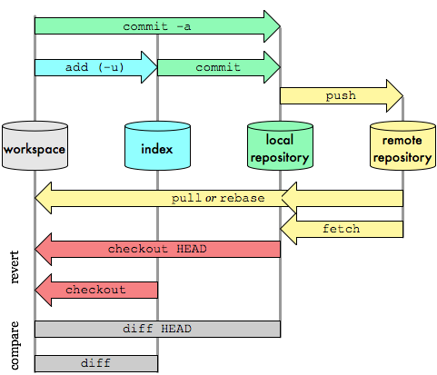
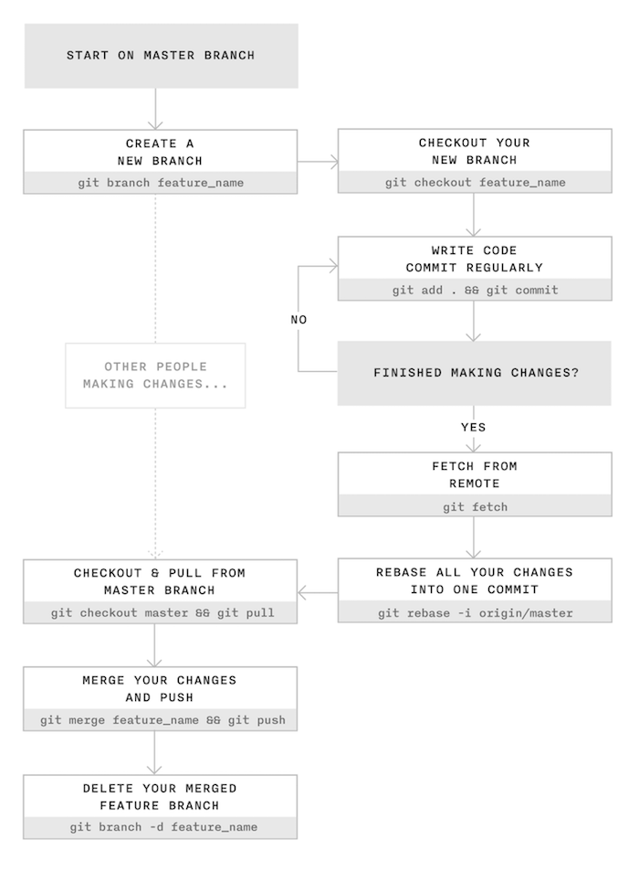

# Taller de introducción a `git` y GitHub

En este taller de introducción a `git` y [GitHub][1] aprenderemos los comandos básicos para empezar a trabajar con repositorios de forma local y remota.

1. [`git`](#git)  
  1.1 [Instalación y configuración de `git`](#instalación-y-configuración-de-git)  
  1.2 [Secciones principales de un repositorio `git`](#secciones-principales-de-un-repositorio-git)  
  1.3 [Estados de un archivo en `git`](#estados-de-un-archivo-en-git)  
  1.4 [Cómo trabajar con un repositorio local](#cómo-trabajar-con-un-repositorio-local)  
  1.5 [Cómo deshacer cambios](#cómo-deshacer-cambios)  
  1.6 [Borrando y moviendo/renombrando archivos](#borrando-y-moviendorenombrando-archivos)  
  1.7 [Cómo trabajar con un repositorio remoto](#cómo-trabajar-con-un-repositorio-remoto)  
  1.8 [El archivo `.gitignore`](#el-archivo-gitignore)  
  1.9 [Consultar el historial de *commits*](#consultar-el-historial-de-commits)  
  1.10 [Branches](#branches)  
  1.11 [Cómo trabajar en equipo con `git`](#cómo-trabajar-en-equipo-con-git)  
2. [GitHub](#github)  
  2.1 [Creación de un nuevo usuario](#crear-un-nuevo-usuario)  
  2.2 [Configuración de GitHub](#configuración-de-github)  
  2.3 [*Pull Requests* en GitHub](#pull-requests-en-github)  
  2.4 [*Issues* en GitHub](#issues-en-github)  

# `git`

## Instalación y configuración de `git`

### Instalación de `git`

#### Ubuntu

```
sudo apt-get update
sudo apt-get install git
```

#### Windows

Descargar desde la web oficial: http://git-scm.com/downloads.

### Configuración de `git`

Configuramos el nombre y el email que aparecerán en los *commits* que hagamos sobre los repositorios.

```
git config --global user.name "Nombre"
```

```
git config --global user.email "correo@electronico.com"
```

Para comprobar si se han aplicado los cambios podemos ejecutar el siguiente comando para mostrar cuál es la configuración actual de `git`:

```
git config --list
```

## Secciones principales de un repositorio `git`

En un repositorio `git` podemos diferenciar las siguientes secciones:

* *Workspace*
* *Staging area (Index)*
* *Local repository*
* *Remote repository*



Figura 1: Imagen de [Oliver Steele](http://osteele.com).

## Estados de un archivo en `git`

Un archivo puede estar en alguno de los siguientes estados:

* Sin seguimiento (*untracked*)
* Preparado (*staged*)
* Modificado (*modified*)
* Confirmado (*commited*)

El siguiente diagrama muestra en qué sección se puede encontrar cada archivo en función de su estado.

```
+-------------+  +-------------+  +-------------+
|  Workspace  |  |   Staging   |  |    Local    |
|             |  |     Area    |  |  Repository |
+------+------+  +------+------+  +------+------+
       |                |                |
       |                |                |
   Untracked            |                |
       |                |                |
   Modified          Staged          Commited
       |                |                |
       |                |                |
       |                |                |
       +                +                +
```

Para consultar el estado de los archivos usamos el comando:

```
git status
```

**Este comando es muy usado** ya que es fundamental conocer el estado de los archivos de nuestro repositorio.

## Cómo trabajar con un repositorio local

### Creación de un repositorio local

Un repositorio Git es un directorio oculto llamado `.git` que se guarda en el directorio raíz de nuestro proyecto. El directorio `.git` almacena el historial de todos los cambios que se han realizado.

El comando para crear un repositorio `git` es el siguiente:

```
git init
```

Por ejemplo, para crear nuestro primer repositorio podríamos hacer lo siguiente:

```
mkdir taller-git
cd taller-git
git init
```

Si examinamos el contenido del directorio `.git` veremos el siguiente árbol de contenidos:

```
.
└── .git
    ├── HEAD
    ├── config
    ├── description
    ├── hooks
    │   ├── applypatch-msg.sample
    │   ├── commit-msg.sample
    │   ├── post-update.sample
    │   ├── pre-applypatch.sample
    │   ├── pre-commit.sample
    │   ├── pre-push.sample
    │   ├── pre-rebase.sample
    │   ├── pre-receive.sample
    │   ├── prepare-commit-msg.sample
    │   └── update.sample
    ├── info
    │   └── exclude
    ├── objects
    │   ├── info
    │   └── pack
    └── refs
        ├── heads
        └── tags
```

### Comandos básicos para trabajar con un repositorio local

**Paso 1**

En primer lugar comprobaremos en qué estado se encuentran los archivos del repositorio:

```
git status
```

**Paso 2**

Si tenemos archivos en estado ***untracked*** o ***modified*** los añadimos a la ***staging area*** con el siguiente comando:

```
git add <nombre_archivo>
```

El comando anterior nos permite seleccionar cuáles son los archivos que queremos mover a la ***staging area***. Si tenemos varios archivos que queremos mover a la ***staging area*** no es necesario hacerlo uno a uno, podemos usar el siguiente comando para moverlos todos a la vez:

```
git add -A
```

**Paso 3**

Una vez que tenemos los archivos en la ***staging area*** tenemos que hacer un ***commit*** para moverlos al repositorio:

```
git commit -m "Breve comentario con los cambios realizados"
```

## Cómo deshacer cambios

### Modificar el texto del último *commit*

```
git commit -m "Modifico el texto del último commit" --amend
```

### Añadir archivos al último *commit*

```
git commit --amend
```

**Ejemplo:**

Suponemos que acabamos de hacer un *commit* en el repositorio pero nos hemos olvidado de añadir un archivo que queremos incluir en ese *commit*. En estos casos podemos utilizar el comando `git commit --amend` para añadir nuevos archivos al último *commit* realizado sobre el repositorio.

A continuación se muestra una posible secuencia de comandos simulando la situación que acabamos de describir.

```
git add archivo.txt
git commit -m "Añadimos el archivo.txt"
git add archivo_olvidado.txt
git commit --amend
```

### Mover un archivo del *staging area* al *workspace*

```
git reset HEAD <archivo>
```

**Ejemplo:**

Suponemos que hemos añadido un archivo llamado `archivo.txt` al *staging area* pero queremos volver a llevarlo al *workspace* para realizar una nueva modificación antes de hacer un *commit* en el repositorio.

El escenario descrito sería el siguiente:

```
+-------------+  +-------------+  +-------------+
|  Workspace  |  |   Staging   |  |    Local    |
|             |  |     Area    |  |  Repository |
+------+------+  +------+------+  +------+------+
       |                |                |
       |                |                |
       |                |                |
       |                |                |
       |            archivo.txt          |
       |                |                |
       |                |                |
       |                |                |
       +                +                +
```

Para mover el archivo `archivo.txt` al *workspace* ejecutamos:

```
git reset HEAD archivo.txt
```

Después del comando anterior el repositorio quedaría así:

```
+-------------+  +-------------+  +-------------+
|  Workspace  |  |   Staging   |  |    Local    |
|             |  |     Area    |  |  Repository |
+------+------+  +------+------+  +------+------+
       |                |                |
       |                |                |
       |                |                |
       |                |                |
   archivo.txt          |                |
   (Modified)           |                |
       |                |                |
       |                |                |
       +                +                +
```

### Deshacer cambios en el *workspace*

```
git ckeckout -- <archivo>
```

**Ejemplo:**

Suponemos que hemos realizado algunos cambios sobre un  archivo llamado `archivo.txt` pero queremos deshacerlos y que el archivo vuelva a tener el contenido con el que se guardó en el último *commit* en el repositorio.

El escenario descrito sería el siguiente:

```
+-------------+  +-------------+  +-------------+
|  Workspace  |  |   Staging   |  |    Local    |
|             |  |     Area    |  |  Repository |
+------+------+  +------+------+  +------+------+
       |                |                |
       |                |                |
       |                |                |
       |                |                |
   archivo.txt          |                |
   (Modified)           |                |
       |                |                |
       |                |                |
       +                +                +
```

Para deshacer los cambios realizados en `archivo.txt` y volver a su estado anterior sería necesario ejecutar:

```
git ckeckout -- archivo.txt
```

## Borrando y moviendo/renombrando archivos

### Borrar un archivo

Para borrar un archivo que ya se encuentra bajo el control de versiones de `git` es necesario utilizar el siguiente comando:

```
git rm <archivo>
```

Vamos a ver los cuatro casos que podemos encontrarnos a la hora de borrar un archivo.

1. Queremos eliminar un archivo que todavía **no ha sido incluido en el repositorio** y se encuentra en la sección `Workspace` con el estado `Untracked`. En este caso no es necesario utilizar ningún comando específico de `git`, lo borraríamos con el comando `rm`.

```
+-------------+  +-------------+  +-------------+
|  Workspace  |  |   Staging   |  |    Local    |
|             |  |     Area    |  |  Repository |
+------+------+  +------+------+  +------+------+
       |                |                |
       |                |                |
       |                |                |
   archivo.txt          |                |
   (Untracked)          |                |
       |                |                |
       |                |                |
       |                |                |
       +                +                +
```

**Ejemplo:**

```
rm archivo.txt
```

2. Queremos eliminar un archivo que **ya está incluido en el repositorio** y se encuentra en la sección `Workspace` con el estado `Modified`.

```
+-------------+  +-------------+  +-------------+
|  Workspace  |  |   Staging   |  |    Local    |
|             |  |     Area    |  |  Repository |
+------+------+  +------+------+  +------+------+
       |                |                |
       |                |                |
       |                |                |
   archivo.txt          |                |
   (Modified)           |                |
       |                |                |
       |                |                |
       |                |                |
       +                +                +
```

3. Queremos eliminar un archivo que **ya está incluido en el repositorio** y se encuentra en la sección `Staging Area` con el estado `Staged`.

```
+-------------+  +-------------+  +-------------+
|  Workspace  |  |   Staging   |  |    Local    |
|             |  |     Area    |  |  Repository |
+------+------+  +------+------+  +------+------+
       |                |                |
       |                |                |
       |                |                |
       |            archivo.txt          |
       |             (Staged)            |
       |                |                |
       |                |                |
       |                |                |
       +                +                +
```

4. Queremos eliminar un archivo que **ya está incluido en el repositorio** y se encuentra en la sección `Local Repository` con el estado `Commited`.

```
+-------------+  +-------------+  +-------------+
|  Workspace  |  |   Staging   |  |    Local    |
|             |  |     Area    |  |  Repository |
+------+------+  +------+------+  +------+------+
       |                |                |
       |                |                |
       |                |                |
       |                |            archivo.txt
       |                |            (Commited)
       |                |                |
       |                |                |
       |                |                |
       +                +                +
```

En los tres últimos casos el archivo que queremos eliminar ya se encuentra bajo el sistema de control de `git`, por este motivo hay que utilizar el comando `git rm` y después habría que hacer un `git commit` para guardar los cambios en el repositorio.

**Ejemplo:**

```
git rm archivo.txt
git commit -m "Se elimina archivo.txt"
```

### Mover/Renombrar archivos

Para mover a otro directorio o renombrar un archivo que ya se encuentra bajo el control de versiones de `git` es necesario utilizar el siguiente comando:

```
git mv <archivo> <nuevo_nombre>
```

A la hora de mover/renombrar archivos nos podemos encontrar los mismos casos que hemos comentado en la sección anterior. Por lo tanto, para mover o renombrar un archivo que todavía **no ha sido incluido en el repositorio** y se encuentra en la sección `Workspace` con el estado `Untracked` no es necesario utilizar ningún comando específico de `git`, lo haríamos con el comando `mv`. Para el resto de casos donde el archivo ya se encuentra bajo el sistema de control de `git`, usaremos el comando `git mv` y después habría que hacer un `git commit` para guardar los cambios en el repositorio.

**Ejemplo:**

```
git mv archivo.txt nuevo_nombre.txt
git commit -m "Se renombra archivo.txt por nuevo_nombre.txt"
```

## Cómo trabajar con un repositorio remoto

Existen dos opciones para empezar a trabajar con un repositorio remoto.

1. Cuando no partimos de ningún repositorio local y lo que queremos hacer es **clonar** el repositorio remoto en nuestra máquina.
2. Cuando ya tenemos creado un repositorio local y queremos **añadir** un repositorio remoto para sincronizarnos.

### Opción 1: Clonar un repositorio remoto

```
git clone <url_del_repositorio_remoto>
```

**Ejemplo:**

```
git clone https://github.com/josejuansanchez/taller-git-github.git
```

Al clonar este repositorio se nos creará un directorio en nuestra máquina con el nombre `taller-git-github` con el contenido del repositorio remoto.

Esta es la opción que yo personalmente suelo utilizar a la hora de trabajar con repositorios remotos. En primer lugar creo el repositorio remoto en `GitHub` y luego hago un `git clone` para clonarlo en mi máquina local.

### Opción 2: Añadir un repositorio remoto a un repositorio ya existente

```
git remote add <alias> <url_del_repositorio_remoto>
```

**Ejemplo:**

Suponemos que ya tenemos creado un repositorio local y queremos añadir el repositorio remoto del taller de git. En este caso hemos usado `taller-git` como alias. Este sería el comando que tendríamos que ejecutar:

```
git remote add taller-git https://github.com/josejuansanchez/taller-git-github.git
```

Para comprobar si el repositorio remoto se ha añadido correctamente ejecutamos:

```
git remote -v
```

El comando anterior nos devolverá estas dos líneas:

```
taller-git	https://github.com/josejuansanchez/taller-git-github.git (fetch)
taller-git	https://github.com/josejuansanchez/taller-git-github.git (push)
```

La primera línea acabada con la palabra *(fectch)* indica que esa es la url del repositorio remoto desde el que podemos recibir cambios.

La segunda línea acabada con la palabra *(push)* indica que esa es la url del repositorio remoto donde podemos enviar nuestros cambios.

### Comandos básicos para trabajar con un repositorio remoto

Utilizaremos los mismos comandos que usamos para trabajar con un repositorio local y además añadiremos `git push` y `git pull`.

#### Enviamos los cambios con `push`

```
git push
```

Usamos este comando para enviar al repositorio remoto los *commits* que hemos hecho en nuestro repositorio local. La forma más habitual de usarlo es hacerlo después de cada `commit`.

```
+-------------+  +-------------+  +-------------+  +-------------+
|  Workspace  |  |   Staging   |  |    Local    |  |    Remote   |
|             |  |     Area    |  |  Repository |  |  Repository |
+------+------+  +------+------+  +------+------+  +------+------+
       |                |                |                |
       |                |                |   git push     |
       |                |                | -------------> |
       |                |                |                |
       |                |                |                |
       |                |                |                |
       |                |                |                |
       |                |                |                |
       +                +                +                +

```

**Ejemplo:**

```
git add archivo.txt
git commit -m "Actualizamos el archivo.txt"
git push
```

#### Recibimos los cambios con `pull`

```
git pull
```

Usamos este comando para recibir los nuevos *commits* que existen en el repositorio remoto y aún no tenemos en nuestro repositorio local. Además de recibir los nuevos cambios, los fusiona con el contenido de nuestro repositorio local, actualizando de este modo los archivos que tengamos en la sección `Local Repository` y `Workspace`. Esto quiere decir que si teníamos un archivo con estado `Modified` en la sección `Workspace` se perderían todos los cambios.

Tenga en cuenta que `git pull` es equivalente a realizar `git fetch` seguido de `git merge`.

```
+-------------+  +-------------+  +-------------+  +-------------+
|  Workspace  |  |   Staging   |  |    Local    |  |    Remote   |
|             |  |     Area    |  |  Repository |  |  Repository |
+------+------+  +------+------+  +------+------+  +------+------+
       |                |                |                |
       |                |                |    git pull    |
       |                |                | <------------- |
       |                |                |                |
       | <----------------------------------------------- |
       |                |                |                |
       |                |                |                |
       |                |                |                |
       +                +                +                +

```

## El archivo `.gitignore`

Dentro del directorio raíz de nuestro proyecto podemos tener un archivo especial llamado `.gitignore` donde indicamos los archivos o tipos de archivos que queremos que sean ignorados por `git`. 

Por ejemplo, si en nuestro repositorio no queremos guardar archivos `*.class` y `*.log` tendríamos el siguiente contenido en el archivo `.gitignore`:

```
*.class
*.log
```

## Consultar el historial de *commits*

Para consultar el historial de *commits* podemos usar el comando `git log`. Este comando muestra información bastante completa de cada uno de los *commits* que se han realizado en el repositorio. Para cada *commit* podemos consultar cuál es la suma de comprobación SHA-1, el nombre, la dirección de correo del autor, la fecha/hora y el mensaje de confirmación del autor.

```
git log
```

La opción `--oneline` nos muestra menos información del historial, mostrando una única línea por *commit*.

```
git log --oneline
```

La opción `--graph` muestra el historial de *branches* y *merges* con un sencillo gráfico ASCII.

```
git log --graph
```

## Branches

> [!NOTE]
> Se recomienda leer el [capítulo 3: Ramificaciones en Git][2] del libro [Pro Git][3] de Scott Chacon y Ben Straub.


Una rama (*branch*) en `git` es simplemente un puntero móvil que apunta a uno de los *commits* del repositorio. La rama por defecto en un repositorio suele llamarse `master` o `main` en los repositorios más recientes. 

Cada vez que realizamos un *commit*, la rama en la que nos encontramos avanza automáticamente hacia el nuevo *commit*. Para saber en qué rama nos encontramos en cada momento, `git` utiliza un puntero especial llamado `HEAD`.

```
                  (HEAD -> main)
                         |
                         v
[C1] -----> [C2] -----> [C3]
```

El uso de ramas permite aislar el desarrollo de nuevas funcionalidades, pruebas o corrección de errores sin alterar la línea de trabajo principal (*main*). Una vez completado y validado el trabajo en una rama, sus cambios pueden integrarse de nuevo en la rama principal.

### Consultar las ramas existentes

Para ver el listado de ramas que tenemos en nuestro repositorio local ejecutamos:

```
git branch
```

La salida del comando mostrará todas las ramas locales disponibles. La rama en la que nos encontramos actualmente aparecerá marcada con un asterisco (`*`) y habitualmente resaltada en color verde:

```
* main
  otra-rama
```

Si queremos listar tanto las ramas locales como las ramas remotas, podemos añadir la opción `-a`:

```
git branch -a
```

Para ver el último *commit* de cada una de las ramas locales podemos utilizar la opción `-v`:

```
git branch -v
```

### Crear una nueva rama

Para crear una nueva rama usamos el siguiente comando:

```
git branch <nombre_de_la_rama>
```

**Ejemplo:**

Creamos una nueva rama llamada `nueva-funcionalidad`:

```
git branch nueva-funcionalidad
```

Es importante tener en cuenta que el comando anterior **únicamente crea la rama**, pero no nos cambia a ella. El puntero `HEAD` sigue apuntando a la rama en la que nos encontrábamos:

```
                     (nueva-funcionalidad)
                         |
                         v
[C1] -----> [C2] -----> [C3]
                         ^
                         |
                      (HEAD -> main)
```

### Cambiar de rama (*checkout*)

Para cambiar de una rama a otra usamos el comando `git checkout`:

```
git checkout <nombre_de_la_rama>
```

En las versiones recientes de `git` también se puede cambiar de rama con el comando `git switch <nombre_de_la_rama>`.

**Ejemplo:**

Cambiamos a la rama `nueva-funcionalidad` que acabamos de crear:

```
git checkout nueva-funcionalidad
```

Al ejecutar este comando, el puntero `HEAD` pasa a apuntar a la rama `nueva-funcionalidad` y el contenido de nuestro *workspace* se actualiza para reflejar el estado de dicha rama:

```
                       (HEAD -> nueva-funcionalidad)
                         |
                         v
[C1] -----> [C2] -----> [C3]
                         ^
                         |
                       (main)
```

Si ahora realizamos un nuevo *commit*, la rama `nueva-funcionalidad` avanzará con la nueva confirmación, mientras que `main` permanecerá en el *commit* anterior:

```
                                    (HEAD -> nueva-funcionalidad)
                                     |
                                     v
[C1] -----> [C2] -----> [C3] -----> [C4]
                         ^
                         |
                      (main)
```

### Crear y cambiar de rama en un solo paso

Existe un atajo que nos permite crear una nueva rama y situarnos en ella en una sola instrucción:

```
git checkout -b <nombre_de_la_rama>
```

En las versiones recientes de `git`también se puede ejecutar el comando:

```
git switch -c <nombre_de_la_rama>
```

**Ejemplo:**

```
git checkout -b correccion-bug
```

Este comando es equivalente a ejecutar `git branch correccion-bug` seguido de `git checkout correccion-bug`.

### Fusionar ramas (*merge*)

Una vez que hemos completado y probado el trabajo en una rama, el siguiente paso es integrar esos cambios en otra rama, que generalmente suele ser la rama `main`. Para fusionar ramas usamos el comando `git merge`:

```
git merge <nombre_de_la_rama_a_fusionar>
```

Para realizar la fusión debemos seguir estos pasos:

1. **Nos situamos en la rama destino que va a recibir los cambios**, por ejemplo la rama `main`:
   ```
   git checkout main
   ```
2. Ejecutamos `git merge` indicando la rama con los cambios que queremos incorporar:
   ```
   git merge nueva-funcionalidad
   ```

A la hora de hacer un *merge* nos podemos encontrar con dos situaciones principales:

#### 1. Fusión Fast-forward (avance rápido)

Una fusión *Fast-forward* ocurre cuando la rama destino no ha recibido ningún cambio desde que se creó la rama que queremos fusionar. En este caso, `git` simplemente avanza el puntero de la rama destino hacia adelante para que apunte al último *commit* de la rama que queremos fusionar.

**Estado antes de la fusión:**

En este ejemplo la rama `main` se encuentra en el *commit* `C3`, creamos la nueva rama `nueva-funcionalidad` y realizamos un nuevo *commit* `C4`.

```
# Creamos una nueva rama y nos situamos en ella
git checkout -b nueva-funcionalidad

# Creamos un nuevo archivo 
touch archivo.txt

# Añadimos el archivo al área de preparación
git add archivo.txt

# Hacemos un commit en la rama nueva-funcionalidad
git commit -m "Se añade una funcionalidad"
```

El estado de las ramas antes de la fusión es el siguiente:

```
                        (HEAD -> main)
                         |
                         v
[C1] -----> [C2] -----> [C3] -----> [C4]
                                     ^
                                     |
                                    (nueva-funcionalidad)
```

**Realizamos la fusión:**

```
# Nos situamos en la rama destino
git checkout main

# Realizamos la fusión de tipo fast-forward
git merge nueva-funcionalidad
```

Al no existir bifurcación en el historial, `git` no necesita crear un nuevo *commit* de fusión. Simplemente **avanza el puntero de `main` hacia adelante (*fast-forward*)** hasta alcanzar `C4`.

**Estado después de la fusión:**

Ahora tanto `main` como `nueva-funcionalidad` apuntan al *commit* `C4`:

```
                                    (nueva-funcionalidad)
                                     |
                                     v
[C1] -----> [C2] -----> [C3] -----> [C4]
                                     ^
                                     |
                                    (HEAD -> main)
```

#### 2. Fusión a tres bandas (*Three-way merge*)

Ocurre cuando ambas ramas han avanzado con *commits* independientes después de haberse bifurcado. En este caso no es posible hacer un avance rápido (*fast-forward*) porque las historias han divergido.

Estado antes de la fusión:

```
                        (HEAD -> main)
                               |
                               v
                       +-----> [C5]
                       |
[C1] -----> [C2] ----->+
                       |
                       +-----> [C4]
                               ^
                               |
                      (nueva-funcionalidad)
```

Para integrar los cambios, `git` realiza una fusión a tres bandas utilizando el último *commit* común (`C2`) y los dos extremos de las ramas (`C5` y `C4`), creando automáticamente un nuevo *commit* de fusión (*merge commit*) que tiene dos padres.

Ejecutamos la fusión desde `main`:

```
git checkout main
git merge nueva-funcionalidad
```

Resultado tras la fusión:

```
                       +-----> [C5] -----+
                       |                 |
[C1] -----> [C2] ----->+                 +-----> [C6] (HEAD -> main)
                       |                 |
                       +-----> [C4] -----+
                               ^
                               |
                      (nueva-funcionalidad)
```

### Resolución de conflictos

Si en las dos ramas que estamos fusionando se ha modificado la **misma parte del mismo archivo**, `git` no podrá resolver automáticamente la fusión y se producirá un **conflicto**.

En ese caso, `git` detendrá el proceso de fusión y mostrará un aviso.

Si ejecutamos `git status`, veremos los archivos en conflicto marcados como no fusionados:

```
git status
```

#### Pasos para resolver un conflicto

1. **Abrir los archivos en conflicto:** Al abrir el archivo con un editor de texto, veremos que `git` ha insertado marcas especiales delimitando las zonas en conflicto:

```
<<<<<<< HEAD
<h1>Título en la rama actual (main)</h1>
=======
<h1>Título en la rama que se fusiona (nueva-funcionalidad)</h1>
>>>>>>> nueva-funcionalidad
```

* El contenido entre `<<<<<<< HEAD` y `=======` corresponde a la versión de la rama actual donde estamos situados (`main`).
* El contenido entre `=======` y `>>>>>>> nueva-funcionalidad` corresponde a la versión de la rama que queremos integrar.

2. **Editar el archivo manualmente:** Debemos decidir qué cambios mantener (o combinarlos) y eliminar las marcas añadidas por `git` (`<<<<<<<`, `=======`, `>>>>>>>`). Por ejemplo:

```
<h1>Título definitivo acordado</h1>
```

3. **Añadir el archivo resuelto a la *staging area*:**

```
git add -A
```

4. **Completar el *commit* de fusión:**

```
git commit -m "Merge branch 'nueva-funcionalidad' resolviendo conflictos"
```

### Eliminar una rama

Una vez que hemos fusionado una rama y ya no la necesitamos, podemos eliminarla para mantener limpio el repositorio.

Para borrar una rama que ya ha sido fusionada ejecutamos:

```
git branch -d <nombre_de_la_rama>
```

**Ejemplo:**

```
git branch -d nueva-funcionalidad
```

Si intentamos borrar una rama que contiene cambios que todavía **no han sido fusionados**, `git` nos mostrará un mensaje de advertencia para evitar la pérdida accidental de trabajo. Si estamos completamente seguros de querer descartar esa rama y sus cambios, podemos forzar el borrado usando la opción `-D`.

```
git branch -D <nombre_de_la_rama>
```

## Cómo trabajar en equipo con `git`



Figura 2: Imagen extraída del blog de [James Chambers](http://jameschambers.co/writing/git-team-workflow-cheatsheet/).

Se recomienda leer el *post* [Using Git in a team: a cheatsheet](http://jameschambers.co/writing/git-team-workflow-cheatsheet/).

# GitHub

Se recomienda leer el [capítulo 6: GitHub][4], del libro [Pro Git][3] de Scott Chacon y Ben Straub.

<!--
## Crear un nuevo usuario

(*Próximamente*)

## Configuración de GitHub

(*Próximamente*)

## *Pull Requests* en GitHub

(*Próximamente*)

## *Issues* en GitHub

(*Próximamente*)
-->

## Tips

* [Recordar la contraseña](https://gist.github.com/ankurk91/f0b26f1c30d0d6d3ca4e).

## Referencias

* [Pro Git](https://git-scm.com/book/es/v2). Scott Chacon, Ben Straub.
* [Aprende Git](https://github.com/oslugr/curso-git). Juan Julián Merelo, Pablo Hinojosa.
* [Git y GitHub. Guía de superviviencia](https://leanpub.com/gitygithub). Luis José Sánchez González.
* [GitHub Guides](https://guides.github.com).
* [Using Git source control in VS Code](https://code.visualstudio.com/docs/sourcecontrol/overview). Visual Studio Code.

## Créditos

* La *Figura 1* es una imagen diseñada por [Oliver Steele](http://osteele.com).
* La *Figura 2* es una imagen extraída del blog de [James Chambers](http://jameschambers.co/writing/git-team-workflow-cheatsheet/).

## Autor

Este material ha sido desarrollado por [José Juan Sánchez](http://josejuansanchez.org).

## Licencia

<a rel="license" href="http://creativecommons.org/licenses/by-sa/4.0/"></a><br />Esta obra está bajo una <a rel="license" href="http://creativecommons.org/licenses/by-sa/4.0/">licencia de Creative Commons Reconocimiento-CompartirIgual 4.0 Internacional</a>.

[1]: https://github.com
[2]: https://git-scm.com/book/es/v2/Ramificaciones-en-Git-%C2%BFQu%C3%A9-es-una-rama%3F
[3]: https://git-scm.com/book/es/v2
[4]: https://git-scm.com/book/es/v2/GitHub-Creaci%C3%B3n-y-configuraci%C3%B3n-de-la-cuenta
